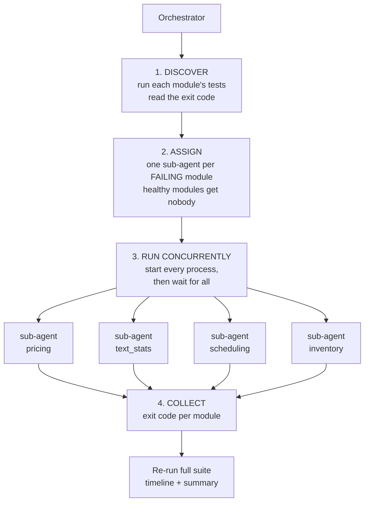
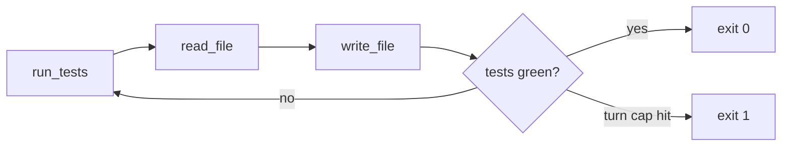
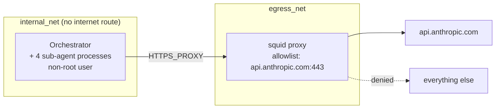

# Parallel Agent Orchestrator

A minimal multi-agent orchestrator: one coordinator splits a repository of failing
tests across several sub-agents that fix their assigned module **at the same time**,
in separate processes, inside a sandboxed container.

Measured on this repo: **about 20 seconds instead of about 60** (end to end), because the
run costs as much as the slowest agent rather than the sum of all of them.

This is a learning project built in stages. It is deliberately small and readable
rather than general purpose. It builds on a single code fixing agent
([code-fixer-agent](https://github.com/dmpapageo/code-fixer-agent)) and adds the one thing that project did not
have: coordination.

## What it does

The target repo contains four independent Python modules, each with one real bug and
its own test file.

| Module | Bug | Failing tests |
| --- | --- | --- |
| `pricing` | Wrong operator: `>` where `>=` was meant, so the free shipping threshold is off by a cent | 1 |
| `text_stats` | Off by one: truncation appends the ellipsis without making room for it | 1 |
| `scheduling` | Missing case: free slots before the first booking are never reported | 2 |
| `inventory` | Wrong logical operator: `or` where `and` was meant, so discontinued items get reordered | 3 |

The orchestrator finds the failing modules, hands each to its own sub-agent, runs them
all concurrently, and reports what happened.

## Architecture



Each sub-agent runs the same gather, act, verify loop as the single agent project:



Three tools only: `read_file`, `write_file`, `run_tests`. No shell, no network tool, no
arbitrary code execution.

```
agent/
  guards.py      ModuleScope path allowlist, iteration cap, is_green
  tools.py       read_file / write_file / run_tests, all module scoped
  subagent.py    the agent loop. CLI: --module pricing
orchestrator/
  discover.py    what work exists, and which of it is broken
  run.py         assign, start all, wait, collect
  report.py      timeline and summary (display only)
target_repo/
  pricing/  text_stats/  scheduling/  inventory/
```

## Why this parallelizes safely

Parallelism is not free. It is only correct here because of three properties, and the
first is a property of the *work*, not the code:

**1. The modules are genuinely independent.** No module imports another. There is no
shared state, no shared config, no shared file. Every module and test filename is
unique. Each module's tests are meaningful on their own, so an agent can verify its own
fix without waiting for anybody else.

**2. The write scopes are disjoint, and enforced.** Each sub-agent is constructed with a
`ModuleScope` rooted at exactly one directory. Every path it asks for is joined onto that
root, fully resolved (following `..` and symlinks), and rejected if the result lands
outside. That makes the containment structural rather than a blacklist:

```
../inventory/inventory.py   ->  resolves out of the module, rejected
/etc/passwd                 ->  an absolute path joins to itself, rejected
a symlink pointing away     ->  resolve() follows it, the real target is checked
```

Two agents writing at the same instant cannot touch the same file, because the guard
will not let them.

**3. The sub-agents are ignorant of each other.** A sub-agent knows only its own module.
It has no concept of the orchestrator, of other modules, or of other agents. There is no
inter-agent protocol to get wrong, because there is no inter-agent communication at all.
The only channel back to the parent is the process exit code, delivered once by the OS.

Because these are separate processes rather than threads, there is no shared memory to
corrupt. Every result is recorded in the parent, in one thread, with each result held
alongside the process that produced it, so a result cannot be attributed to the wrong
module no matter what order agents finish in.

### The key insight

**Multi-agent parallelism wins on independent work and loses on tightly coupled work.**

If `pricing` imported `inventory`, agent A's fix could break agent B's passing tests, and
B's verify step would report a failure it did not cause. You would need locking, or a
merge step, or a shared plan, and the coordination cost would eat the speedup. The
honest version of the lesson is that the hard part of this project was not the
concurrency. It was building a target repo where concurrency is *valid*.

Before reaching for multiple agents, the question to ask is not "can I run these in
parallel" but "is this work actually independent". If it is not, one agent working
sequentially is usually both simpler and faster.

## Containment

Sub-agents run as child processes inside a single container, so N agents share exactly
one egress boundary. Adding agents does not widen the network surface.



- **No internet route.** The agent container sits only on a Docker network marked
  `internal: true`. Even if it ignored the proxy settings, it has nowhere to go.
- **Allowlist proxy.** Squid permits CONNECT to `api.anthropic.com:443` and denies
  everything else.
- **Non-root.** Everything runs as an unprivileged user. Only `target_repo/` is writable.
  The `agent/` and `orchestrator/` code is root owned, so an agent cannot edit its own
  loop or its own guards.
- **Iteration cap.** Each sub-agent halts after a fixed number of turns, so a stuck agent
  cannot loop forever.
- **The API key is never baked into the image.** It is read from your shell at run time
  and inherited by child processes. The orchestrator never reads or logs it.

Verified by running these inside the container: `example.com` is refused by the proxy,
`api.anthropic.com` is reachable and returns 401 without credentials.

## Results

Measured on this repo, all four modules fixed, full suite green at 23 passed:

| | Sequential | Parallel |
| --- | --- | --- |
| End to end (`time docker compose run ...`) | about 60s | about 20s |
| Agent phase (wall clock) | 47.4s of work | 13.0s |
| Slowest single agent | n/a | 13.0s |

There are two speedup numbers, and they measure different things. Both are worth
stating:

- **About 3.6x**, sum of agent runtimes divided by wall clock (47.4s / 13.0s). This is
  what the summary prints, and it is the honest measure of the parallel phase itself.
- **About 3x**, end to end, roughly 60s down to roughly 20s. This is what a stopwatch
  shows, because it also includes container startup and the discovery pass, which are
  sequential no matter how many agents you run.

The first number is the one to quote about the orchestration. The second is the one a
user actually experiences.

Real output from a run. Exact per-agent times vary between runs, since LLM latency does:

```
==================== TIMELINE ====================
  each bar character is about 0.3s

  scheduling   |########################################|  13.0s  GREEN
  text_stats   |######################################  |  12.5s  GREEN
  inventory    |###################################     |  11.4s  GREEN
  pricing      |################################        |  10.5s  GREEN

  all agents started at 0.0s. longest agent set the total.

==================== SUMMARY ====================
  inventory    GREEN      pid=11      exit=0
  pricing      GREEN      pid=12      exit=0
  scheduling   GREEN      pid=13      exit=0
  text_stats   GREEN      pid=14      exit=0

  modules fixed     : 4/4
  wall clock        :  13.0s
  sum of runtimes   :  47.4s (roughly what running them one at a time would cost)
  speedup           : 3.6x
```

The speedup is bounded by the **slowest** agent, not the average. Adding a fifth trivial
module would cost almost nothing. Adding one slower than the current critical path would
set a new floor. This is Amdahl's law with a very visible critical path.

Worth noting from the numbers above: the four agents finished within 2.5s of each other,
and the slowest was `scheduling` even though `inventory` had the most failing tests (3
against 2). Turn count is driven by how quickly the model finds the bug, not by how many
tests it breaks. With runtimes this tightly clustered, the parallel speedup is close to
the theoretical maximum of 4x, because almost no agent sits idle waiting on the critical
path. A single slow outlier would pull the ratio down sharply.

It is also worth noting what does *not* scale: four concurrent agents make four
concurrent API request streams. On a rate limited key the wall clock stops improving and
starts being set by throttling rather than by the work.

## Running it

The API key is passed from your shell and is never stored in the image.

```bash
export ANTHROPIC_API_KEY=sk-ant-...

docker compose build

# the full parallel run
docker compose run --rm orchestrator python -m orchestrator.run

# see each agent's full transcript, grouped by agent
docker compose run --rm orchestrator python -m orchestrator.run --logs

# watch the raw interleaved output live, as it really happens
docker compose run --rm orchestrator python -m orchestrator.run --stream

# one sub-agent on one module
docker compose run --rm orchestrator python -m agent.subagent --module pricing

# verify the whole suite in the same container
docker compose run --rm orchestrator bash -c \
  "python -m orchestrator.run && python -m pytest -q target_repo/"

docker compose down
```

Each `docker compose run` starts a fresh container, so fixes do not persist between
commands. Chain them with `bash -c` to see the result of a fix.

Environment overrides: `AGENT_MODEL` (default `claude-opus-4-8`) and
`AGENT_MAX_ITERATIONS` (default 10, lower it to watch the iteration cap fire).

## Honest limitations

- **The target repo is built for this.** The modules were designed to be independent.
  Real codebases rarely partition this cleanly, and finding the seam is the hard part.
- **Discovery is one level deep.** A "unit of work" is a top level directory. Anything
  more sophisticated is a different project.
- **No inter-agent communication.** By design, but it means this approach cannot handle a
  bug spanning two modules. Nobody would notice.
- **No retry across agents.** If one agent fails, the others still succeed and the run
  reports a partial result. It does not reassign the failure.
- **The sequential comparison is approximate.** The 60s baseline and the 20s parallel run
  were single measurements on one machine, with LLM latency varying between runs.
